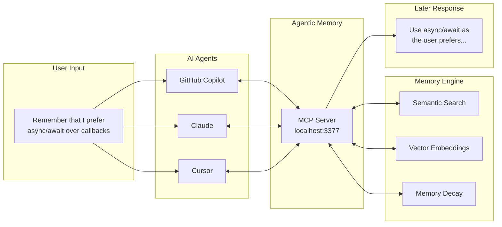

<div align="center">

# Agentic Memory

### **Give Your AI Agents Persistent, Human-Like Memory**

[](https://dotnet.microsoft.com/)
[](https://modelcontextprotocol.io/)
[](https://opensource.org/licenses/MIT)
[]()

*The missing memory layer for AI assistants. Works with GitHub Copilot, Claude, Cursor, and any MCP-compatible agent.*

[Quick Start](#quick-start) • [Copilot Setup](#github-copilot-integration) • [Claude Setup](#claude-desktop-setup) • [API Reference](#api-reference)

</div>

---

## Why Agentic Memory?

**AI agents forget everything between sessions.** Every conversation starts from zero. User preferences, project decisions, technical patterns—all lost.

**Agentic Memory fixes this.** It gives your AI agents a persistent, searchable memory that:

- ✅ **Remembers** user preferences, decisions, and context across sessions
- ✅ **Searches** semantically—find memories by meaning, not just keywords
- ✅ **Evolves** naturally—memories strengthen with use and fade when forgotten
- ✅ **Runs locally**—your data never leaves your machine
- ✅ **Integrates instantly**—one config file for Copilot, Claude, Cursor, and more



---

## Features

| Feature | Description |
|---------|-------------|
| **Semantic Search** | Vector similarity using ONNX SBERT embeddings (all-MiniLM-L6-v2) |
| **Fuzzy Text Match** | Trigram-based matching for typo tolerance and partial matches |
| **Memory Reinforcement** | Frequently accessed memories become stronger over time |
| **Natural Decay** | Unused memories fade, mimicking human cognition |
| **Auto-Consolidation** | Similar memories merge automatically to reduce clutter |
| **Conflict Resolution** | Smart duplicate detection, superseding, and temporal history |
| **Memory Graph** | Link related memories together for context traversal |
| **Rich Tagging** | Organize memories with tags and linked relationships |
| **Batch Operations** | Bulk create, update, delete, and search for efficiency |
| **MCP Protocol** | Native support for Model Context Protocol |
| **REST API** | Full HTTP API for custom integrations |
| **Zero Dependencies** | Embedded LiteDB database—no external services needed |
| **Privacy First** | 100% local, offline-capable, your data stays yours |

---

## Technology Stack

| Component | Technology | Purpose |
|-----------|------------|---------|
| **Runtime** | .NET 10 | High-performance, cross-platform execution |
| **Database** | LiteDB 5.0 | Embedded NoSQL document store |
| **Embeddings** | ONNX Runtime + ML.Tokenizers | Local vector generation |
| **Model** | all-MiniLM-L6-v2 | Sentence transformer (384 dimensions) |
| **Server** | Custom TCP/HTTP | Optimized, minimal-dependency HTTP server |
| **Protocol** | MCP (Model Context Protocol) | AI agent integration standard |
| **Testing** | xUnit v3 | Comprehensive test coverage |

---

## Quick Start

### 1. Clone & Build
```bash
git clone https://github.com/lionheartaaron/agentic-memory.git
cd agentic-memory
dotnet build
```

### 2. Run the Server
```bash
dotnet run --project agentic-memory
```

### 3. Server Ready!
```
   Agentic Memory Server
   MCP Endpoint: http://localhost:3377/mcp
   Web Interface: http://localhost:3377
   Status: Ready for connections
```

The ONNX embedding model downloads automatically on first run (~90MB).

---

## GitHub Copilot Integration

### Step 1: Start Agentic Memory
```bash
cd agentic-memory
dotnet run
```

### Step 2: Configure MCP in VS Code

Create `.vscode/mcp.json` in your workspace:

```json
{
  "servers": {
    "agentic-memory": {
      "type": "http",
      "url": "http://localhost:3377/mcp"
    }
  }
}
```

> **Global Setup:** Add to VS Code User Settings (`settings.json`) for all workspaces.

### Step 3: Add Agent Instructions

Create `.github/copilot-instructions.md` in your repository:

````markdown
## Memory System Instructions

You have access to a persistent memory system via the `agentic-memory` MCP server.
Use it to remember user preferences, project decisions, and important context across sessions.

### When to Search Memories
- At the START of conversations about recurring topics
- When the user references something you should "remember"
- Before making recommendations that should consider past context
- When asked about previous discussions or decisions

### When to Store Memories
- User explicitly asks you to remember something
- Important decisions or preferences are expressed
- Technical configurations or project-specific patterns are established
- You learn something significant about the user's workflow

### Memory Best Practices
1. **Always search before storing** - Avoid duplicates by checking if similar memories exist
2. **Use descriptive titles** - Make memories easy to find later
3. **Tag consistently** - Use tags like: `user-preference`, `project-config`, `decision`, `technical`
4. **Set importance appropriately**:
   - 0.9-1.0: Critical info (API keys context, core preferences)
   - 0.6-0.8: Important (project decisions, technical patterns)
   - 0.3-0.5: Normal (general context, minor preferences)
   - 0.1-0.2: Temporary (session-specific info)
5. **Update rather than duplicate** - If info changes, update the existing memory

### Example Usage Patterns

**Starting a session:**
```
Search memories for: "user preferences" and "[project name]"
```

**User says "Remember that I prefer...":**
```
1. Search for existing preference memories
2. If found: update_memory with new info
3. If not found: store_memory with tags ["user-preference"]
```

**Technical decision made:**
```
store_memory:
  title: "Architecture decision: [topic]"
  summary: "[One line decision]"
  content: "[Full context and reasoning]"
  tags: ["decision", "architecture", "[project]"]
  importance: 0.7
```
````

### Step 4: Verify Connection

In VS Code with Copilot Chat, you should now see `agentic-memory` tools available. Try:
- *"Search your memory for my coding preferences"*
- *"Remember that I prefer tabs over spaces"*

---

## Claude Desktop Setup

Add to your `claude_desktop_config.json`:

**macOS:** `~/Library/Application Support/Claude/claude_desktop_config.json`  
**Windows:** `%APPDATA%\Claude\claude_desktop_config.json`

```json
{
  "mcpServers": {
    "agentic-memory": {
      "url": "http://localhost:3377/mcp"
    }
  }
}
```

Restart Claude Desktop to enable the connection.

---

## Cursor IDE Setup

Create `.cursor/mcp.json` in your workspace:

```json
{
  "mcpServers": {
    "agentic-memory": {
      "url": "http://localhost:3377/mcp"
    }
  }
}
```

---

## Other MCP-Compatible Agents

Any agent supporting the Model Context Protocol can connect to:

```
http://localhost:3377/mcp
```

The server implements the full MCP specification including:
- `initialize` / `initialized` handshake
- `tools/list` and `tools/call` for memory operations
- `resources/list` and `resources/read` for memory access

---

## MCP Tools Reference

| Tool | Description | Parameters |
|------|-------------|------------|
| `search_memories` | Semantic + fuzzy search | `query`, `top_n`, `tags` (all optional except query) |
| `store_memory` | Create with conflict resolution | `title`, `summary`, `content`, `tags`, `importance` |
| `update_memory` | Modify existing memory | `id`, `title`, `summary`, `content`, `tags` |
| `get_memory` | Retrieve by ID (reinforces) | `id` |
| `delete_memory` | Permanently remove | `id` |
| `get_stats` | Server statistics | — |
| `get_tag_history` | View memory history for a tag | `tag`, `include_archived` |

### MCP Resources

| URI | Description |
|-----|-------------|
| `memory://recent` | Last 10 accessed memories |
| `memory://stats` | Repository statistics |
| `memory://{id}` | Specific memory by ID |

---

## API Reference

### Memory Endpoints

| Method | Endpoint | Description |
|--------|----------|-------------|
| `GET` | `/` | Web interface for browsing memories |
| `GET` | `/search?q=query` | Search memories (HTML/JSON) |
| `POST` | `/api/memory` | Create memory (with conflict resolution) |
| `GET` | `/api/memory/{id}` | Get memory by ID |
| `PUT` | `/api/memory/{id}` | Update memory |
| `DELETE` | `/api/memory/{id}` | Delete memory |
| `POST` | `/api/memory/search` | Semantic search (JSON) |

### Batch Endpoints

| Method | Endpoint | Description |
|--------|----------|-------------|
| `POST` | `/api/memory/batch` | Batch create memories |
| `PUT` | `/api/memory/batch` | Batch update memories |
| `DELETE` | `/api/memory/batch` | Batch delete memories |
| `POST` | `/api/memory/search/batch` | Batch search queries |

### Graph Endpoints

| Method | Endpoint | Description |
|--------|----------|-------------|
| `GET` | `/api/memory/{id}/links` | Get linked memories |
| `POST` | `/api/memory/{id}/link/{targetId}` | Create link between memories |
| `DELETE` | `/api/memory/{id}/link/{targetId}` | Remove link |
| `GET` | `/api/memory/{id}/graph` | Get memory subgraph |

### Admin Endpoints

| Method | Endpoint | Description |
|--------|----------|-------------|
| `GET` | `/api/admin/stats` | Server statistics |
| `GET` | `/api/admin/health` | Health check |
| `GET` | `/api/admin/maintenance/status` | Maintenance task status |
| `POST` | `/api/admin/consolidate` | Trigger memory consolidation |
| `POST` | `/api/admin/prune` | Trigger weak memory pruning |
| `POST` | `/api/admin/reindex` | Rebuild search indexes |
| `POST` | `/api/admin/compact` | Compact database |

### MCP Endpoint

| Method | Endpoint | Description |
|--------|----------|-------------|
| `POST` | `/mcp` | MCP JSON-RPC 2.0 endpoint |

### Example: Store a Memory

```bash
curl -X POST http://localhost:3377/api/memory \
  -H "Content-Type: application/json" \
  -d '{
    "title": "User prefers dark themes",
    "summary": "Always suggest dark mode configurations",
    "content": "The user explicitly stated they prefer dark themes across all IDEs, terminals, and web applications.",
    "tags": ["user-preference", "ui", "themes"],
    "importance": 0.8
  }'
```

### Example: Search Memories

```bash
curl "http://localhost:3377/search?q=user+preferences"
```

---

## Configuration

Edit `appsettings.json` to customize behavior. Here's a complete reference:

### Server Settings

| Setting | Default | Description |
|---------|---------|-------------|
| `Port` | `3377` | HTTP server port |
| `BindAddress` | `0.0.0.0` | Network interface to bind (use `127.0.0.1` for local only) |
| `MaxConcurrentConnections` | `1000` | Maximum simultaneous connections |
| `ConnectionTimeoutSeconds` | `30` | Idle connection timeout |
| `RequestTimeoutSeconds` | `10` | Maximum request processing time |
| `ShutdownTimeoutSeconds` | `30` | Graceful shutdown wait time |
| `EnableKeepAlive` | `false` | HTTP keep-alive connections |
| `ServerName` | `AgenticMemory/1.0` | Server header identifier |
| `MaxRequestSizeBytes` | `10485760` | Maximum request body size (10MB) |
| `MaxHeaderSizeBytes` | `8192` | Maximum HTTP header size (8KB) |

### Storage Settings

| Setting | Default | Description |
|---------|---------|-------------|
| `DatabasePath` | `./Data/agentic-memory.db` | LiteDB database file location |
| `MaxContentSizeBytes` | `524288` | Maximum memory content size (512KB) |
| `MaxTitleLength` | `500` | Maximum title character length |
| `MaxSummaryLength` | `2000` | Maximum summary character length |
| `MaxTagsPerMemory` | `20` | Maximum tags per memory |

### Embeddings Settings

| Setting | Default | Description |
|---------|---------|-------------|
| `Enabled` | `true` | Enable semantic vector embeddings |
| `ModelsPath` | `./Models` | Directory for ONNX model files |
| `AutoDownload` | `true` | Auto-download model on first run |
| `ModelUrlOnnx` | *(HuggingFace URL)* | ONNX model download URL |
| `ModelVocabUrlTxt` | *(HuggingFace URL)* | Vocabulary file download URL |
| `ModelFileName` | `all-MiniLM-L6-v2.onnx` | ONNX model filename |
| `VocabFileName` | `vocab.txt` | Vocabulary filename |
| `ModelDimensions` | `384` | Embedding vector dimensions |
| `MaxSequenceLength` | `256` | Maximum tokens per input |

### Maintenance Settings

| Setting | Default | Description |
|---------|---------|-------------|
| `Enabled` | `true` | Enable background maintenance tasks |
| `DecayEnabled` | `true` | Enable memory strength decay |
| `DecayIntervalHours` | `24` | Hours between decay cycles |
| `PruneThreshold` | `0.1` | Remove memories below this strength |
| `ConsolidationEnabled` | `true` | Enable automatic memory merging |
| `ConsolidationIntervalHours` | `24` | Hours between consolidation cycles |
| `SimilarityThreshold` | `0.8` | Similarity score to trigger consolidation |
| `InitialDelayMinutes` | `5` | Delay before first maintenance run |

### Conflict Resolution Settings

| Setting | Default | Description |
|---------|---------|-------------|
| `DuplicateSimilarityThreshold` | `0.95` | Memories above this are duplicates (reinforce existing) |
| `SupersedeSimilarityThreshold` | `0.8` | Memories above this supersede/replace the old one |
| `CoexistSimilarityThreshold` | `0.6` | Memories above this are related but coexist |

### Logging Settings

| Setting | Default | Description |
|---------|---------|-------------|
| `LogLevel.Default` | `Information` | Default log verbosity |
| `LogLevel.Microsoft` | `Warning` | Microsoft framework log level |

### Example Full Configuration

```json
{
  "Server": {
    "Port": 3377,
    "BindAddress": "0.0.0.0",
    "MaxConcurrentConnections": 1000,
    "ConnectionTimeoutSeconds": 30,
    "RequestTimeoutSeconds": 10,
    "EnableKeepAlive": false
  },
  "Storage": {
    "DatabasePath": "./data/agentic-memory.db",
    "MaxContentSizeBytes": 524288,
    "MaxTagsPerMemory": 20
  },
  "Embeddings": {
    "Enabled": true,
    "ModelsPath": "./models",
    "AutoDownload": true,
    "ModelDimensions": 384,
    "MaxSequenceLength": 256
  },
  "Maintenance": {
    "Enabled": true,
    "DecayEnabled": true,
    "DecayIntervalHours": 24,
    "PruneThreshold": 0.1,
    "ConsolidationEnabled": true,
    "SimilarityThreshold": 0.8
  },
  "Conflict": {
    "DuplicateSimilarityThreshold": 0.95,
    "SupersedeSimilarityThreshold": 0.8,
    "CoexistSimilarityThreshold": 0.6
  },
  "Logging": {
    "LogLevel": {
      "Default": "Information",
      "Microsoft": "Warning"
    }
  }
}
```

---

## Architecture

```
agentic-memory/
├── Brain/                    # Core memory engine
│   ├── Embeddings/          # ONNX vector generation
│   ├── Search/              # Semantic + fuzzy search
│   ├── Storage/             # LiteDB repository
│   ├── Maintenance/         # Decay, consolidation, pruning
│   └── Conflict/            # State conflict resolution
├── Http/                     # Server layer
│   ├── Handlers/            # REST API handlers
│   ├── Mcp/                 # MCP protocol implementation
│   ├── Middleware/          # Logging, timing, errors
│   └── Optimizations/       # Performance enhancements
└── Configuration/            # App settings
```

---

## Testing

The project includes a comprehensive test suite using xUnit v3:

```bash
dotnet test
```

Tests cover core memory operations, MCP protocol compliance, search accuracy, and maintenance behaviors.

---

## How It Works

### 1. Memory Storage
Memories are stored as documents in LiteDB with:
- **Text content** (title, summary, full content)
- **Vector embeddings** (384-dimensional SBERT vectors)
- **Metadata** (tags, timestamps, importance, strength)
- **Relationships** (linked memory IDs)
- **State flags** (current vs. archived/superseded)

### 2. Semantic Search
When you search:
1. Query text → Vector embedding via ONNX SBERT
2. Cosine similarity against all memory vectors
3. Fuzzy trigram matching for text fallback
4. Score combination: `semantic × 0.6 + fuzzy × 0.2 + strength × 0.1 + recency × 0.1`

### 3. Conflict Resolution
When storing new memories, the system automatically handles conflicts:

| Similarity Score | Action | Example |
|------------------|--------|---------|
| **≥ 0.95** (Duplicate) | Reinforce existing memory | Same fact stated differently |
| **≥ 0.8** (Supersede) | Archive old, store new | "I work at Google" → "I work at Microsoft" |
| **≥ 0.6** (Coexist) | Store as related | Different aspects of same topic |
| **< 0.6** | Store independently | Unrelated memories |

**Archived memories are preserved** for history—use `get_tag_history` to view past states.

### 4. Memory Lifecycle
- **Creation**: New memories start with base strength
- **Reinforcement**: Each access increases strength
- **Decay**: Unused memories weaken over time (configurable)
- **Consolidation**: Similar memories merge automatically
- **Pruning**: Very weak memories are removed

### 5. Memory Linking
Memories can be linked to form a knowledge graph:
- Create bidirectional links between related memories
- Traverse links to discover context
- Use `/api/memory/{id}/graph` to visualize connections

---

## Contributing

Contributions welcome! Please open an issue or PR.

---

## License

MIT License — use freely in personal and commercial projects.

---

<div align="center">

**Agentic Memory**

*Give your AI agents the memory they deserve.*

[GitHub](https://github.com/lionheartaaron/agentic-memory) • [Issues](https://github.com/lionheartaaron/agentic-memory/issues)

</div>
