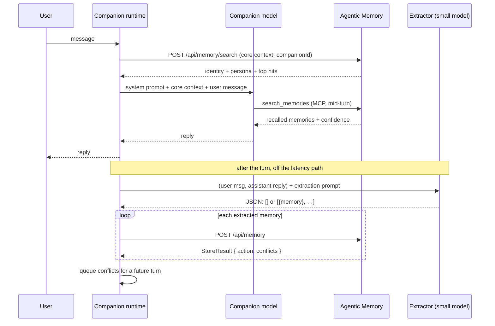

# Companion API

**How an AI companion app uses Agentic Memory.** The full surface, the payloads, and the loop the
two halves are meant to run in.

This document is written for the team building the companion runtime. It assumes the server is
running as a sidecar (see [Running as a sidecar](#running-as-a-sidecar)) and covers both halves of
the integration:

- **[The read path](#the-read-path-mcp-during-the-turn):** the companion model queries memory in
  real time over MCP, mid-turn, as a tool.
- **[The write path](#the-write-path-extraction-after-the-turn):** a second, cheaper model reads
  the finished exchange, decides what was worth keeping, and emits structured JSON to store.

They are deliberately separate. The read path is inside the user's latency budget and must be fast
and conservative; the write path is not, and can afford to be careful.

---

## Contents

- [The one rule](#the-one-rule)
- [Mental model: five axes](#mental-model-five-axes)
- [Two surfaces: MCP and REST](#two-surfaces-mcp-and-rest)
- [The turn lifecycle](#the-turn-lifecycle)
- [The read path: MCP during the turn](#the-read-path-mcp-during-the-turn)
- [The write path: extraction after the turn](#the-write-path-extraction-after-the-turn)
- [Conflicts: the loop that makes a companion feel attentive](#conflicts-the-loop-that-makes-a-companion-feel-attentive)
- [Full MCP reference](#full-mcp-reference)
- [Full REST reference](#full-rest-reference)
- [Vocabularies](#vocabularies)
- [The slot registry](#the-slot-registry)
- [Running as a sidecar](#running-as-a-sidecar)
- [Security: read this before shipping](#security-read-this-before-shipping)
- [Failure modes](#failure-modes)
- [Anti-patterns](#anti-patterns)

---

## The one rule

> **Always pass `companionId` on the conversational path.**

`userId` is the tenancy boundary and memories never cross it. `companionId` is the *visibility*
boundary, and on the REST surface it behaves differently depending on whether you send it:

| Call | Scope | Sees |
|---|---|---|
| `POST /api/memory/search` with `userId` **and** `companionId` | `MemoryScope.For` | Global memories + **this companion's** private ones |
| `POST /api/memory/search` with `userId` only | `MemoryScope.AllFor` | **Everything for that user, including every other companion's private memories** |

The second form is an *administrative* view. It exists for the dashboard, where the human owner is
looking at their own store and should see all of it. If your companion runtime calls it, Aria will
recall what the user told Mika in confidence, which is the single failure this whole subsystem was
built to make impossible.

The MCP surface does not have this trap: `search_memories` without `companion_id` searches only
memories shared by all companions. But be explicit anyway.

Verified against a running server. A memory stored private to Aria, then searched for three ways:

```
search as companionId=mika          → 0 results, confidence None      ✅ isolated
search as companionId=aria          → 1 result                        ✅ correct
search with userId only, no companion → 1 result, Aria's private memory  ⚠️ administrative scope
```

---

## Mental model: five axes

A memory is not a blob of text with tags. Five independent axes govern its behaviour, and collapsing
any of them into free-text tags is what causes cross-companion leakage and false conflicts.

| Axis | Field | Question it answers | Values |
|---|---|---|---|
| **1. Tenancy** | `userId` | Whose store is this? | Any string, normalised to lowercase. Never crossed. |
| **2. Visibility** | `visibility` + `companionIds` | Which companions may *recall* it? | `global` (all) or `private` (only the listed companion) |
| **3. Subject** | `subject` | Who is it *about*? | `user`, `companion:<id>`, `relationship:<id>`, `person:<name>` |
| **4. Slot** | `predicate` + `value` | Which attribute is asserted? | `employer`, `allergies`, … (see the [slot registry](#the-slot-registry)) |
| **5. Type** | `type` | Which lifecycle rules apply? | `semantic`, `identity`, `preference`, `persona`, `episodic`, `affective`, `ephemeral` |

`tags` remains for soft categorisation and is **never load-bearing**. Never use it for access
control.

### Visibility and subject are not the same thing

This is the distinction that trips people up:

```
"Aria's favourite colour is blue"
  subject:    companion:aria      ← it is ABOUT Aria
  visibility: global              ← but every companion may know it

"The user is planning a surprise for Mika"
  subject:    person:mika         ← it is ABOUT Mika
  visibility: private to aria     ← only Aria may recall it
```

Without a separate subject axis, *"the user's favourite colour"* and *"Aria's favourite colour"*
produce near-identical embeddings, and storing one will archive the other.

### Why `predicate` matters more than anything else you set

`predicate` is what lets a new value **replace** an old one. Without it, memories always coexist:

```
No predicate:   "works at Acme" + "works at Globex"  → both active forever, both retrievable,
                                                        the companion contradicts itself
predicate=employer: "works at Globex"                → supersedes Acme, which is retained as
                                                        history and still reachable via as_of
```

Coexisting is *safe*, and nothing is lost, but it leaves stale facts in circulation. Set a predicate
on anything that can change.

---

## Two surfaces: MCP and REST

|  | MCP | REST |
|---|---|---|
| **Endpoint** | `http://127.0.0.1:3377/mcp` | `http://127.0.0.1:3377/api/…` |
| **Consumer** | The companion model, as tool calls | Your application code |
| **Returns** | **Formatted text** (markdown), designed to be read by an LLM | **JSON** |
| **Use for** | Real-time recall inside a turn | Extraction writes, dashboards, admin, batch work |
| **Auth** | Same key, same headers | Same key, same headers |

**MCP tools return strings, not JSON.** `search_memories` returns a markdown block with confidence,
scoping notes and per-memory annotations already phrased for a model to act on. Do not try to parse
it. If you need structured data, use REST.

Both surfaces hit the same store, the same scope rules and the same conflict logic.

---

## The turn lifecycle



Two things to note about the ordering:

- **Core context is fetched by your app, not by the model.** Identity and persona memories are
  needed on every turn regardless of what was asked, so prepending them is cheaper and more reliable
  than hoping the model calls a tool.
- **Extraction runs after the reply is sent.** The user is not waiting on it. This is what lets you
  use a slower, more careful prompt than you could afford mid-turn.

---

## The read path: MCP during the turn

### Register the server

Streamable HTTP, MCP protocol revision `2025-06-18`.

```json
{
  "mcpServers": {
    "agentic-memory": {
      "url": "http://127.0.0.1:3377/mcp",
      "headers": { "X-API-Key": "…" }
    }
  }
}
```

Drop `headers` if you have not set a key, but see [Security](#security-read-this-before-shipping)
before deciding not to.

### What to put in the companion's system prompt

The tools carry their own descriptions, but the model needs the *policy*:

```markdown
You have persistent memory of this user via the `agentic-memory` tools.
Your user_id is "{userId}" and your companion_id is "{companionId}".
Pass both on every call. Never pass a different companion_id.

- Search before you claim to remember something, and before recommending anything
  you may have discussed before.
- The result carries a Confidence. If it is Low or None, say you do not recall
  rather than guessing. Guessing is worse than admitting a gap.
- If a memory is annotated "you have not mentioned this before", you may introduce
  it naturally. If it says you have mentioned it N times, refer back to it instead
  of announcing it again.
- If the result lists unresolved contradictions, ask the user about them in your
  own words. Do not pick a side silently.
- Do not call store_memory. Storing is handled outside the conversation.
```

That last line is a design decision worth making deliberately. See
[Should the companion write directly?](#should-the-companion-write-directly).

### `search_memories`

The only tool most turns need.

| Parameter | Type | Default | Notes |
|---|---|---|---|
| `query` | string | required | Natural language. Concepts, keywords or a question. |
| `user_id` | string | required | The isolation boundary. |
| `companion_id` | string? | null | Omit and you search **only global** memories. |
| `top_n` | int | 5 | Clamped to 1-100. |
| `tags` | string[]? | null | Exact, case-insensitive. Applied inside the scoped query, before truncation. |
| `subject` | string? | null | `user`, `companion:<id>`, `person:<name>`. |
| `predicate` | string? | null | Restricts to a slot **and** acts as an exact-match retrieval channel. |
| `include_core_context` | bool | false | Also return always-on identity and persona memories. |
| `as_of` | string? | null | ISO-8601. Returns what was true then, including facts since replaced. |
| `novelty_bias` | double | 0 | 0-1 preference for memories this companion has not already raised. |

**Response** (text):

```
Confidence: High. Searched 412 memories in scope.

## Always known
- Name: The user's name is Alex
- Persona: You are Aria, warm, direct, a little dry

## Recalled
**User works at Globex** (relevance 1.00, via slot+vector)
ID: 4f9c2e1a-...
Alex started at Globex in March 2026 as a staff engineer.
about: user | shared | slot: employer | source: UserStated | recorded 2026-03-14 09:12:40 UTC | you have mentioned this once already

## Unresolved contradictions, worth asking the user about
- [8c1b...] newer: "Favourite food is pho. user favourite food" (recorded 2026-07-31 11:02:07 UTC); earlier: "Favourite food is ramen. user favourite food" (recorded 2026-02-09 18:44:51 UTC); 'favourite_food' change should be confirmed
```

Read it as follows:

- **`Confidence`:** `None` / `Low` / `Medium` / `High`. Derived from agreement across retrieval
  channels, not from a single similarity score. `High` means several independent channels agreed,
  or a structured slot matched exactly.
- **`via slot+vector`:** which channels surfaced it. `slot` is an exact structured match and is the
  strongest signal available.
- **`shared` / `private to aria`:** the visibility axis, so the model knows whether it may reference
  the memory in front of a different companion's context.
- **`recorded <timestamp>`:** when the fact was written, to the second. This is the only thing that
  separates a correction from the thing it corrected, and two memories about one subject routinely
  tie on relevance. Where two results say different things, the later timestamp is the current one.
- **`you have mentioned this N times already`:** per-companion awareness. This is what stops a
  companion re-announcing the same fact every time it becomes relevant.

### When two results disagree

A result that is one side of an open contradiction carries a warning line of its own, and the memory
on the other side is in the same response:

```
**Allergies** (relevance 1.00, via lexical+vector)
ID: 8ec42f7c-...
The user is not allergic to anything
about: user | shared | source: UserStated | recorded 2026-07-31 04:45:09 UTC | you have not mentioned this before
! Another memory in these results contradicts this one. Do not answer from it alone: read both,
prefer the more recently recorded, and check the contradictions listed below.
```

The marker appears only when **both** sides came back in this response. A lone result whose
counterpart fell outside the scope or the `top_n` is not something the model can weigh, and flagging
it would teach the companion to distrust every answer.

Results are ordered by relevance, and ties broken by recency, so the correction reads before the
thing it corrected. Do not rely on order alone: read the timestamps.

### `novelty_bias`: what it is and is not

A **penalty on the fused score, never a filter**. A memory that answers the question is always
returned, however often it has been raised. What changes is which of several *equally relevant*
memories the companion reaches for, so the third conversation about the user's job surfaces
something other than the opener.

Reasonable defaults: `0` for a direct question, `0.3-0.5` for open-ended or "tell me something"
turns.

### `as_of`: point-in-time recall

*"Where was I working last year?"* cannot be answered from current state, because the fact that
replaced the right answer is the one still active. `as_of` filters on the valid-time axis: a memory
qualifies when its validity window contains the instant.

```
as_of: "2025-06-01T00:00:00Z"  →  returns "works at Acme" (since superseded)
```

Superseded memories are included automatically. Memories the user asked to forget are still
excluded, because a forget is a forget at every point in time.

### Latency

There is no ANN index; the vector channel scores the whole scope-filtered set. Measured at **86 ms**
per query over 10,001 memories in one user's scope, warm. Budget one search per turn comfortably;
budget five and you are adding half a second.

---

## The write path: extraction after the turn

### Why a separate model

The companion model is optimised for being good company, and asking it to also produce clean,
schema-conformant memory records mid-turn trades away both. A second pass with a small, cheap model
is better on every axis:

- It sees the **whole exchange**, user message *and* reply, so it can tell a genuine
  disclosure from the companion's own speculation.
- It is off the latency path, so the prompt can be long and the schema strict.
- It can be given exactly one job, with examples, and be evaluated on it.
- It is cheap enough to run on every turn, which is what you want. The alternative is a heuristic
  that misses things.

You have two options for the model itself:

| Option | How | Trade-off |
|---|---|---|
| **The built-in local model** | `POST /api/generate`. Phi-4-mini-instruct, int4, runs on CPU in-process | Fully offline; ~5 GB download; set `Generation.Enabled: true`. Multi-second on CPU. |
| **An external small model** | Your own call to a hosted small model | Faster and better at strict JSON; sends conversation content off-device, which may defeat the point of a local-first companion. |

For a local-first product the built-in model is the coherent choice, and the latency is acceptable
because nobody is waiting.

### What to extract, and what not to

The extractor's hardest job is **saying no**. Most turns contain nothing worth keeping, and a store
full of *"the user said hello"* is worse than an empty one, because it dilutes retrieval and burns the
user's trust the first time the companion recalls something trivial.

**Store:**

| Signal | Example | Type |
|---|---|---|
| A stated fact about the user's life | "I started at Globex last month" | `semantic` + predicate `employer` |
| Core identity | "My birthday is the 3rd of June" | `identity` + predicate `birthday` |
| A durable preference | "I can't stand horror films" | `preference` + predicate `dislikes` |
| Something safety-relevant | "I'm allergic to shellfish" | `semantic` + predicate `allergies`, pinned |
| A meaningful event | "I got the promotion!" | `episodic` |
| Emotional state or relationship texture | "I've been struggling this week" | `affective` |
| Something belonging to this relationship | an inside joke, a nickname | `private`, subject `relationship:<companion>` |
| Genuinely temporary context | "I'm on a train right now" | `ephemeral` + `expires_in_hours` |

**Do not store:**

- Anything the *companion* said, unless the user confirmed it. The companion asserting "you seem
  tired" is not a fact about the user.
- Pleasantries, acknowledgements, meta-conversation about the app.
- Restatements of something already known. Search first, or let the store's duplicate detection
  handle it (it will reinforce rather than duplicate).
- Anything the user hedged: *"I might move to Berlin"* is not `city_of_residence`. If you store
  speculation, mark it `source: companion_inferred` and `confidence` below 1.0.

### The extraction prompt

```
You extract durable memories from a conversation between a user and their AI companion.

Return ONLY a JSON array. Return [] when nothing is worth remembering. This is the
common case and is always an acceptable answer.

Store a memory only if it will still be true and still be useful in a month.
Never store the companion's own speculation as fact. Never store pleasantries.

Each object:
{
  "title":       string,   // short, e.g. "User works at Globex"
  "summary":     string,   // 1-2 sentences, the key information
  "content":     string,   // optional, fuller context
  "type":        "semantic"|"identity"|"preference"|"persona"|"episodic"|"affective"|"ephemeral",
  "predicate":   string|null,   // MUST be from the slot list below, or null
  "value":       string|null,   // normalised value for that slot, e.g. "globex"
  "subject":     "user"|"companion:<id>"|"relationship:<id>"|"person:<name>",
  "visibility":  "global"|"private",
  "source":      "user_stated"|"companion_inferred",
  "sensitivity": "normal"|"sensitive"|"restricted",
  "importance":  0.0-1.0,
  "confidence":  0.0-1.0,   // how sure you are this is a real, correctly-read fact
  "tags":        string[],
  "verbatim_quote": string|null,  // what the user actually said
  "expires_in_hours": number|null // ephemeral only
}

Known predicates (use one of these or null, do not invent):
employer, job_title, city_of_residence, country_of_residence, relationship_status,
current_mood, nickname_for_user, pronouns, full_name, birthday, favourite_food,
favourite_colour, favourite_music, allergies, medical_condition, hobbies, friends,
family_member, pets, goals, dislikes, shared_joke

Rules:
- "user_stated" only for something the USER said. Anything you inferred is
  "companion_inferred", which can never overwrite a user-stated fact.
- "private" for anything belonging to this one relationship: an inside joke, something
  said in confidence to this companion. "global" for facts about the user's life that
  every companion should know.
- Set "predicate" whenever the memory asserts one of the attributes above. Without it
  a new value will coexist with the old one instead of replacing it.
- "sensitive"/"restricted" for intimate disclosures, health, finances.

Companion: {companionId}
---
User: {userMessage}
Companion: {assistantReply}
```

Pin the predicate list in the prompt rather than letting the model invent one. An unknown predicate
is not an error. It degrades to "coexist, never supersede", which is safe, but you lose the
replacement behaviour that makes the slot worth setting. You can fetch the live list at
`GET /api/memory/slots`.

### Worked examples

**A job change, the case predicates exist for.**

```
User:      Finally handed in my notice at Acme. Start at Globex on the 3rd.
Companion: That's huge, congratulations. How are you feeling about it?
```

```json
[{
  "title": "User works at Globex",
  "summary": "Alex left Acme and starts at Globex on the 3rd.",
  "type": "semantic", "predicate": "employer", "value": "globex",
  "subject": "user", "visibility": "global", "source": "user_stated",
  "sensitivity": "normal", "importance": 0.7, "confidence": 1.0,
  "tags": ["work", "career"],
  "verbatim_quote": "Finally handed in my notice at Acme. Start at Globex on the 3rd."
}]
```

Stores with `action: 1`. The old employer memory is superseded, retained as history, and still
reachable via `as_of` and `get_slot_history`.

**Nothing worth keeping, the common case.**

```
User:      haha fair
Companion: Right? Anyway, you were saying about the weekend.
```

```json
[]
```

An extractor that never returns `[]` is broken. Most turns produce nothing.

**Safety-relevant, and multi-valued.**

```
User:      Careful with the restaurant pick, shellfish is a hard no for me, I'm allergic.
```

```json
[{
  "title": "User is allergic to shellfish",
  "summary": "Alex has a shellfish allergy and cannot eat it.",
  "type": "semantic", "predicate": "allergies", "value": "shellfish",
  "subject": "user", "visibility": "global", "source": "user_stated",
  "sensitivity": "sensitive", "importance": 1.0, "confidence": 1.0,
  "tags": ["health", "food", "safety"]
}]
```

`allergies` is multi-valued and never auto-removed, so a second allergy later will **coexist**
rather than replace this one. That is the correct behaviour and the reason the slot is defined that
way, because a second allergy does not cure the first.

**Private to one relationship.**

```
User:      ok this is just between us, I'm planning something for Mika's birthday.
```

```json
[{
  "title": "Planning a surprise for Mika",
  "summary": "Alex is planning something for Mika's birthday and asked to keep it private.",
  "type": "episodic", "predicate": null, "value": null,
  "subject": "person:mika", "visibility": "private", "source": "user_stated",
  "sensitivity": "normal", "importance": 0.6, "confidence": 1.0,
  "tags": ["mika", "birthday", "surprise"]
}]
```

`visibility: private` + `companionId` in the store call means only this companion can recall it. The
subject is `person:mika` because it is *about* Mika, which is orthogonal to who may see it.

**Inference, not statement.**

```
User:      third late night this week, I'm wrecked
Companion: You've been pushing hard. Is the new job eating your evenings?
User:      pretty much
```

```json
[{
  "title": "User is working long hours",
  "summary": "Alex has had several late nights this week and confirmed the new job is taking their evenings.",
  "type": "affective", "predicate": "current_mood", "value": "exhausted",
  "subject": "user", "visibility": "global", "source": "user_stated",
  "sensitivity": "normal", "importance": 0.5, "confidence": 0.8,
  "tags": ["wellbeing", "work"],
  "expires_in_hours": null
}]
```

`user_stated` is right here only because the user confirmed it ("pretty much"). Had they not, this
should be `companion_inferred` with a lower confidence, which then cannot overwrite anything the
user has said outright, and raises a `ProvenanceDowngrade` conflict if it tries.

**Genuinely temporary.**

```
User:      on the train to Manchester, signal's terrible
```

```json
[{
  "title": "User is travelling to Manchester",
  "summary": "Alex is on a train to Manchester with poor signal.",
  "type": "ephemeral", "predicate": null, "value": null,
  "subject": "user", "visibility": "global", "source": "user_stated",
  "sensitivity": "normal", "importance": 0.2, "confidence": 1.0,
  "tags": ["travel"], "expires_in_hours": 6
}]
```

`ephemeral` is the only type for which `expires_in_hours` means anything. Without it this becomes a
permanent belief that the user is on a train.

### Mapping the JSON to a store call

One `POST /api/memory` per extracted object.

```http
POST /api/memory
Content-Type: application/json
```

```json
{
  "title": "User works at Globex",
  "summary": "Alex started at Globex in March 2026 as a staff engineer.",
  "content": "Moved from Acme after four years. Mentioned the commute is shorter.",
  "tags": ["work", "career"],
  "importance": 0.7,
  "userId": "alex",
  "companionId": "aria",
  "visibility": "global",
  "subject": "user",
  "predicate": "employer",
  "value": "globex",
  "type": "semantic",
  "source": "user_stated",
  "pinned": false
}
```

Field notes, from the actual binding:

| Field | Behaviour |
|---|---|
| `title`, `summary` | **Required.** Omitting either currently throws. See [Failure modes](#failure-modes). |
| `visibility` | `"private"` or `"scoped"` → private. **Anything else, including omitted, → global.** |
| `companionId` | **Required** when visibility is private, else `400`. Ignored for global memories. |
| `subject` | Lowercased; empty → `"user"`. |
| `predicate` | Lowercased, spaces → underscores. Unknown values are accepted and coexist. |
| `value` | Normalised to lowercase alphanumerics + single spaces. **Falls back to `summary`** if omitted, so set it explicitly for slots, or two phrasings of the same fact will look like different values. |
| `type` | Parsed case-insensitively; unrecognised → `semantic`. |
| `source` | Underscores stripped before parsing, so `user_stated` works; unrecognised → `user_stated`. |
| `importance` | Defaults `0.5`. Ranking only, and never affects retention. |

> The REST create endpoint does **not** accept `confidence`, `sensitivity`, `verbatim_quote`,
> `conversation_id` or `expires_in_hours`. The MCP `store_memory` tool does. If your extractor
> produces those fields, and it should, write through MCP, or extend `MemoryCreateRequest`.
> This asymmetry is a gap in the REST surface, not a design decision.

### What comes back, and how to react

`201 Created` with a `StoreResult`:

```json
{
  "memory": { "id": "4f9c…", "version": 1, "userId": "alex", "…": "…" },
  "action": 1,
  "supersededMemories": [ { "id": "1a2b…", "title": "User works at Acme", "…": "…" } ],
  "conflicts": [],
  "contradictionCandidates": [],
  "message": "Memory stored. Superseded 1 previous memory: 'User works at Acme'."
}
```

> **`conflicts` and `contradictionCandidates` are not the same list.** A conflict has been decided:
> something judged that these two memories disagree, and it is recorded. A candidate has not.
> See [Substitutions the service will not judge](#substitutions-the-service-will-not-judge).

> **Enums come back as integers.** `action`, `visibility`, `type`, `source`, `state` and
> `sensitivity` are all numeric in JSON responses, even though the request side accepts them as
> strings (`"visibility": "private"`, `"type": "episodic"`). The one exception is `confidence` in
> the search envelope, which the endpoint stringifies explicitly (`"High"`). Map the integers
> yourself. The tables in [Vocabularies](#vocabularies) list them in declaration order, which is
> the numeric order.

| `action` | Value | Meaning | What your app should do |
|---|---|---|---|
| `StoredNew` | `0` | First memory of its kind | Nothing |
| `StoredWithSupersede` | `1` | Legally replaced an earlier value; the old one is retained as history | Optionally note it. *"got it, Globex now"* reads well |
| `ReinforcedExisting` | `2` | A restatement. The existing memory was strengthened, no duplicate created | Nothing. This is the system working. |
| `StoredCoexist` | `3` | Both remain active (multi-valued slot, or no predicate) | Nothing |
| `StoredWithConflict` | `4` | Stored, **and** a contradiction was recorded for someone to settle | Queue the conflict, see below |

Observed messages, so you can log rather than parse them:

```
0  "Memory stored successfully."
1  "Memory stored. Superseded 1 previous memory: 'User works at Acme'."
2  "Similar memory already exists. Reinforced 'User works at Globex' instead of duplicating it."
```

Notice there is no failure mode where a memory is lost. Conflict resolution never deletes.

### The stored record

What you get back in `memory`, and in every read endpoint. Derived and internal fields are included
in the response. `searchText`, `contentNormalized`, `trigrams` and `embeddingBytes` are retrieval
machinery and can be ignored (`trigrams` in particular is long; strip it before logging).

```json
{
  "id": "39568a8f-…", "version": 1, "userId": "alex",
  "visibility": 0, "companionIds": [],
  "subjectRef": "user", "predicate": "employer", "valueKey": "globex",
  "type": 0, "sensitivity": 0, "source": 0, "confidence": 1,
  "tags": [],
  "title": "User works at Globex",
  "summary": "Alex started at Globex in March 2026",
  "content": null, "verbatimQuote": null,
  "conversationId": null, "messageId": null,

  "createdAt": "2026-07-31T00:35:28.101Z",
  "ingestedAt": "2026-07-31T00:35:28.108Z",
  "eventTime": null,
  "validFrom": "2026-07-31T00:35:28.108Z",
  "validUntil": null,
  "expiresAt": null,
  "lastAccessedAt": "2026-07-31T00:35:28.372Z",

  "state": 0, "supersededBy": null,
  "supersededIds": ["7d5dde14-…"],
  "mergedInto": null, "linkedNodeIds": [],

  "importance": 0.5, "baseStrength": 1.1, "decayRate": 0.1,
  "accessCount": 1, "isPinned": false,

  "embeddingModel": "all-MiniLM-L6-v2-384d/text-v2", "embeddingDim": 384,
  "isArchived": false, "isExpired": false, "isCurrent": true
}
```

The two time axes are both here and both load-bearing: `ingestedAt` is when the system learned it,
`validFrom`/`validUntil` is when it was true in the world. `as_of` filters on the second.
`isCurrent`, `isArchived` and `isExpired` are computed views over `state` and `expiresAt`, not
stored fields.

### Should the companion write directly?

The MCP surface exposes `store_memory`, so the companion model *can* write mid-turn. Both designs
work; pick one deliberately.

| | Extraction pass (recommended) | Companion writes directly |
|---|---|---|
| Consistency | One prompt, one schema, evaluable | Varies with conversational context |
| Latency | Off the turn | Adds a tool round-trip mid-reply |
| Coverage | Every turn, uniformly | Only when the model remembers to |
| Cost | One extra small-model call per turn | Free |
| Failure mode | Extractor over- or under-fires; fixable in one prompt | Companion forgets to store, or stores its own speculation as fact |

The extraction pass is recommended because *"the companion forgot to remember"* is the failure users
notice most, and it is exactly the failure a model asked to do two jobs at once will produce.

A reasonable hybrid: extraction handles the default path; the companion keeps `store_memory` for the
explicit case, *"remember that for me"*, where the user has asked directly and the turn should
visibly succeed.

### Batching and ordering

- Extracted memories are independent; store them in any order. Each `POST` is its own transaction.
- Do not fire them concurrently against the same slot. Two writes to `employer` in the same instant
  can both see the other as absent and both store, producing a coexist pair rather than a supersede.
  Sequential is fine, since these are millisecond writes.
- If a store fails, retry it. Retrying a successful store is harmless: the duplicate detector
  reinforces instead of duplicating.

---

## Conflicts: the loop that makes a companion feel attentive

When the system detects a contradiction it refuses to resolve on its own, it records it and keeps
both memories active. Surfacing that is not an error report. *"wait, I thought you were still at
Acme?"* is good companion behaviour, and it converts a data-integrity problem into a moment that
reads as attention.

### The loop

1. `POST /api/memory` returns `action: "StoredWithConflict"` with `conflicts[]`, **or**
   `search_memories` includes an *"Unresolved contradictions"* block, **or** you poll
   `GET /api/memory/conflicts` (`list_conflicts` over MCP).
2. Your runtime queues the conflict against that user + companion.
3. **Read both sides before raising it.** The list response inlines them, so this costs nothing
   extra. A companion that asks *"which of these two is right?"* without knowing what either one
   says cannot phrase the question, and the two values are usually what makes it answerable.
4. On a later turn, not necessarily the next one, the companion raises it in its own words.
5. The user answers.
6. Your runtime calls resolve with the ID of the side the user picked.

If the wrong side ends up winning, `restore_memory` (`POST /api/memory/{id}/restore`) brings the
loser back to Active. That, rather than resolving a second time, is the undo: see `AlreadySettled`
below.

```http
POST /api/memory/conflicts/{conflictId}/resolve
```

```json
{ "winnerId": "4f9c2e1a-…", "dismiss": false, "userId": "alex", "companionId": "aria" }
```

- `winnerId`: the memory that is correct. **It must be one of the two memories in this conflict**;
  any other ID is refused rather than guessed at. The loser becomes history, **not** deleted, and is
  still reachable through `as_of`, `get_slot_history` and `restore_memory`.
- `dismiss: true` (omit `winnerId`): both are valid; just stop flagging it. Use for
  *"actually I like both"*.

| Response | Meaning |
|---|---|
| `200 {"outcome":"Resolved","winnerId":…}` | A side won; the other is superseded |
| `200 {"outcome":"Dismissed","winnerId":null}` | Both kept, no longer flagged |
| `404` | No such conflict in this scope |
| `400 WinnerNotInConflict` | `winnerId` is not one of the two sides. **Nothing was changed** |
| `400 NoChoice` | Neither `winnerId` nor `dismiss: true` was given |
| `409 AlreadySettled` | Settled once already. Restore the memory that should have won instead |

Those four rejections all used to return `204` and, in the first case, supersede the wrong memory.
If you built against the old behaviour, check that you are not treating a `4xx` as success.

**Why `AlreadySettled` is a refusal rather than an overwrite.** Resolving picks a winner and
supersedes the other side. Doing it twice with opposite winners would supersede the first winner as
well, leaving the slot with nothing current and both memories out of recall. Bringing back the side
that should have won is a `restore_memory` call, and it leaves the audit trail honest about what
happened.

Over MCP the same tool covers all of it:

```
list_conflicts(user_id, companion_id?, open_only=true)
resolve_conflict(conflict_id, user_id, winner_id?, dismiss=false, companion_id?)
```

`list_conflicts` returns both memories in full and ends each entry with the exact `resolve_conflict`
call to make, so the model does not have to work out which ID goes where. Pass `open_only: false` to
audit decisions already taken. Every refusal comes back as a sentence saying what to do instead,
because the model is the thing that has to recover from it.

### Substitutions the service will not judge

There is a shape neither detector can rule on. Two affirmative statements, no registered slot on
either side, filling the same claim with different values:

> *"my car is a blue Corolla"* against *"my car is a red Civic"*

The slot gate has no jurisdiction, because nothing is registered. The polarity detector does not
fire, because neither side denies anything. Before this existed, both were stored, both stayed
active, and both came back from recall.

It is left undecided because **wording cannot tell it apart from a pair that is simply two facts**:

> *"I have a dog called Salt"* against *"I have a cat called Pepper"*

Identical shape, both true. Separating them needs something that knows what cars and pets are, so
the store narrows the corpus to the handful worth asking about and hands them back:

```json
{
  "action": 3,
  "conflicts": [],
  "contradictionCandidates": [
    {
      "existingMemoryId": "d79e81bb-…",
      "existingStatement": "Car. The user's car is a blue Corolla",
      "newMemoryId": "749af27b-…",
      "newStatement": "Car. The user's car is a red Civic",
      "similarity": 0.87,
      "frame": "car user"
    }
  ],
  "message": "Memory stored alongside 1 related memory."
}
```

- `frame` is the wording the two share, which is what the disagreement is about if it is one.
- Both statements come back **in full**, so the question is answerable without fetching either
  memory back.
- At most **three** per write, ranked by similarity. A single remembered sentence must not turn into
  twenty model calls, and past the first few the pairs are the least likely to be real.
- The prefilter needs raw cosine `0.80` and a shared frame of `0.25` of the shorter statement. With
  no embeddings available the wording bar rises to `0.6`, because nothing else is left to judge on.

Send the pair to whatever model your extractor already uses. If it says yes, post it back:

```http
POST /api/memory/conflicts
```

```json
{
  "existingMemoryId": "d79e81bb-…",
  "newMemoryId": "749af27b-…",
  "reason": "A person has one car; these give it two different makes.",
  "userId": "alex",
  "companionId": "aria"
}
```

`201 Created` with the `MemoryConflict`, which then behaves exactly like one the service found
itself: it appears in `GET /api/memory/conflicts`, in `list_conflicts`, in the *"Unresolved
contradictions"* block of a recall, and it is settled through the same resolve endpoint.

| Response | Meaning |
|---|---|
| `201` | Recorded. Kind is `SubstitutionContradiction` |
| `200` | This pair is already open. The existing conflict is returned rather than a second one raised |
| `400` | `existingMemoryId` and `newMemoryId` are the same memory |
| `404` | One or both memories do not exist, or are not visible to this scope |

Three things worth knowing:

- **It is idempotent by pair.** An adjudication retried after a dropped response returns the conflict
  already open. The companion never asks the same question twice because of a network blip.
- **The kind is fixed, not taken from you.** You cannot post an `ImmutableViolation` or a
  `CrossScopeContradiction`. Those are findings the service makes about its own invariants, and no
  client is in a position to assert one.
- **Both sides are fetched through your scope**, so a caller cannot raise a contradiction about a
  memory it may not see. That would leak the memory's existence through the very conflict list built
  to surface it.

**Ignoring `contradictionCandidates` entirely is a valid choice.** You get exactly the old behaviour:
both memories active, no contradiction raised, nothing broken.

> **REST only.** `contradictionCandidates` is on the `StoreResult` returned by
> `POST /api/memory`. The MCP `store_memory` tool returns formatted text and does not surface them,
> so a companion writing through MCP will not see this loop. Write through REST if you want it.

### Reading a conflict

`GET /api/memory/conflicts` and `GET /api/memory/conflicts/{id}` return each contradiction with
**both memories inlined**, so deciding does not cost a fetch per side. That matters beyond
round-trips: a memory the user has asked to forget cannot be fetched by ID at all, so a side in that
state would otherwise be invisible in the very decision it is part of.

```json
{
  "conflict": {
    "id": "d97f9e05-…",
    "userId": "alex",
    "newMemoryId": "749af27b-…",
    "existingMemoryId": "d79e81bb-…",
    "subjectRef": "user",
    "predicate": "favourite_food",
    "kind": 1,
    "status": 0,
    "detectedAt": "2026-07-31T00:37:11.148Z",
    "resolvedAt": null,
    "winnerId": null,
    "description": "newer: \"Favourite food is pho. user favourite food\" (recorded 2026-07-31 11:02:07 UTC); earlier: \"Favourite food is ramen. user favourite food\" (recorded 2026-02-09 18:44:51 UTC); 'favourite_food' change should be confirmed",
    "companionId": "aria"
  },
  "existing": {
    "id": "d79e81bb-…", "title": "Favourite food is ramen", "summary": "user favourite food",
    "valueKey": "ramen", "state": 0, "source": 0, "confidence": 1,
    "createdAt": "…", "validFrom": "…", "isPinned": false
  },
  "new": {
    "id": "749af27b-…", "title": "Favourite food is pho", "summary": "user favourite food",
    "valueKey": "pho", "state": 0, "source": 3, "confidence": 1,
    "createdAt": "…", "validFrom": "…", "isPinned": false
  }
}
```

`existing` or `new` is `null` when the current scope may not see that memory.

`description` is written to be paraphrased by a companion, so hand it to the model rather than
composing your own line from the IDs. Each side is quoted as `title. summary`, which is how the
service reads a memory as a single claim. It quotes **both statements in full and timestamps each**,
because the two memories in a contradiction very often share a title: a user correcting himself says
"Allergies" twice, and a description naming only the titles read `'Allergies' contradicts
'Allergies'`, which told the reader nothing at all. `valueKey` and `source` are what the decision
usually turns on: a `UserStated` side against a `CompanionInferred` one is rarely a real toss-up.

**`status`:** `0` Open · `1` Resolved · `2` Dismissed.

### Conflict kinds

| # | Kind | Meaning | Typical companion line |
|---|---|---|---|
| `0` | `ValueReplaced` | Same singular slot, new value won | *"Globex now, congratulations!"* |
| `1` | `SoftPreferenceChange` | A soft-singular preference changed | *"Didn't you say ramen was the favourite?"* |
| `2` | `ImmutableViolation` | Something that should not change (birthday, legal name) was contradicted | *"I have your birthday as June 3rd. Did I get that wrong?"* |
| `3` | `CrossScopeContradiction` | A companion-private memory contradicts one all companions share | Ask carefully, since resolving it silently would erase knowledge from every other companion |
| `4` | `ProvenanceDowngrade` | Something inferred contradicts something the user stated outright | Trust the user; ask before changing |
| `5` | `PolarityContradiction` | One memory denies what another asserts, no slot on either side | *"I'm not sure, do you still…?"* |
| `6` | `SubstitutionContradiction` | Two affirmative statements fill the same claim with different values. Never raised by the service alone; recorded only after something adjudicated it | *"Hang on, is it the Corolla or the Civic?"* |

---

## Full MCP reference

Every memory tool takes `user_id`. Most take `companion_id`. All return **formatted text**.

### `search_memories`
See [above](#search_memories). The tool most turns need.

### `store_memory`
The richest write surface, accepting everything the extractor produces.

| Parameter | Type | Default | Notes |
|---|---|---|---|
| `title` | string | required | |
| `summary` | string | required | |
| `user_id` | string | required | |
| `content` | string? | null | Full details |
| `companion_id` | string? | null | Required when `visibility` is `private` |
| `visibility` | string | `"global"` | `global` \| `private` |
| `subject` | string | `"user"` | `user` \| `companion:<id>` \| `relationship:<id>` \| `person:<name>` |
| `predicate` | string? | null | Strongly recommended for anything that can change |
| `value` | string? | summary | Normalised slot value |
| `type` | string | `"semantic"` | See [types](#memory-types) |
| `source` | string | `"user_stated"` | See [sources](#sources) |
| `tags` | string[]? | null | Capped at `Storage.MaxTagsPerMemory` (20) |
| `importance` | double | 0.5 | Ranking only |
| `confidence` | double | 1.0 | Extraction confidence |
| `sensitivity` | string | `"normal"` | `normal` \| `sensitive` \| `restricted` |
| `pinned` | bool | false | Never ages out of the working set |
| `expires_in_hours` | double? | null | Ephemeral context only |
| `verbatim_quote` | string? | null | What the user actually said |
| `conversation_id` | string? | null | Provenance |

Returns the action taken, the new ID, any conflicts, and a tip if no predicate was set.

### The rest

| Tool | Parameters | Returns |
|---|---|---|
| `update_memory` | `id`, `user_id`, `companion_id?`, `title?`, `summary?`, `content?`, `tags?`, `pinned?` | Confirmation, or a concurrency error telling you to re-read and retry |
| `get_memory` | `id`, `user_id`, `companion_id?` | Full record incl. provenance, state, strength. **Reinforces on read.** |
| `forget_memory` | `id`, `user_id`, `companion_id?` | Tombstones it. Restorable until purged. |
| `restore_memory` | `id`, `user_id`, `companion_id?` | Undoes a forget, archive **or** supersede |
| `get_slot_history` | `user_id`, `predicate`, `subject`, `companion_id?` | Every value ever recorded for that pair, newest first, with validity windows |
| `get_tag_history` | `user_id`, `tag`, `companion_id?`, `include_archived` | Same for a tag. Prefer slot history for structured facts. |
| `list_conflicts` | `user_id`, `companion_id?`, `open_only=true` | Each contradiction with **both memories in full**: title, summary, value, state, provenance, plus the exact `resolve_conflict` call to make |
| `resolve_conflict` | `conflict_id`, `user_id`, `winner_id?`, `dismiss`, `companion_id?` | What happened, and what to do about it if it was refused |
| `get_memory_history` | `id` | Audit trail: created, updated, superseded, archived, forgotten, restored, purged, and by what |
| `list_slots` | none | Known predicates with cardinality and conflict policy |
| `get_stats` | `user_id` | Totals by state, open conflicts, average strength, DB size |

### Code intelligence tools

The same server also exposes compiler-backed code intelligence: `get_subproject_context`,
`get_file_context`, `get_symbol_context`, `get_symbol_sourcecode`, `search_code`, `list_symbols`,
`get_callers`. Irrelevant to a companion app; see the [README](README.md#mcp-tools). If your
companion has no coding role, you may want to not register them, to keep the tool list short and the
model's choices unambiguous.

---

## Full REST reference

Base: `http://127.0.0.1:3377`

### Memory

| Method | Path | Body / Query | Returns |
|---|---|---|---|
| `GET` | `/api/memory` | `?userId=&companionId=&includeArchived=` | `Memory[]`, newest first |
| `GET` | `/api/memory/{id}` | `?userId=&companionId=` | `Memory` · `404` |
| `POST` | `/api/memory` | `MemoryCreateRequest` | `201` + `StoreResult` · `400` if private without companion |
| `PUT` | `/api/memory/{id}` | `{title?, summary?, content?, tags?}` + `?userId=&companionId=` | `Memory` · `404` · **`409`** on concurrent modification |
| `DELETE` | `/api/memory/{id}` | `?userId=&companionId=` | `204`, a **soft delete**, tombstoned · `404` |
| `POST` | `/api/memory/{id}/restore` | `?userId=&companionId=` | `204` · `404` |
| `GET` | `/api/memory/{id}/history` | none | `MemoryEvent[]` |
| `POST` | `/api/memory/search` | `SearchRequest` | Search envelope (below) |

**`SearchRequest`:**

```json
{
  "query": "what does the user do for work",
  "topN": 5,
  "tags": ["work"],
  "userId": "alex",
  "companionId": "aria",
  "subject": "user",
  "predicate": "employer",
  "includeCoreContext": true,
  "asOf": null,
  "noveltyBias": 0.3
}
```

**Search response envelope:**

```json
{
  "results": [
    {
      "memory": { "…": "…" },
      "score": 1.0,
      "semanticScore": 0.71,
      "fuzzyScore": 0.0,
      "strengthScore": 0.98,
      "recencyScore": 0.91,
      "matchedChannels": ["slot", "vector"],
      "isCoreContext": false,
      "timesSurfacedToCompanion": 1,
      "lastSurfacedToCompanionAt": "2026-07-29T11:02:00Z"
    }
  ],
  "coreContext": [],
  "conflicts": [],
  "confidence": "High",
  "candidatesConsidered": 412,
  "semanticSearchUsed": true,
  "incomparableEmbeddings": 0
}
```

`incomparableEmbeddings > 0` means some stored vectors came from a different embedding model and
were skipped. It is surfaced rather than absorbed: a non-zero value means a reindex is needed and
semantic recall is silently degraded until you do it.

### Slots and conflicts

| Method | Path | Body / Query | Returns |
|---|---|---|---|
| `GET` | `/api/memory/slots` | none | `SlotDefinition[]`: predicate, cardinality, policy |
| `GET` | `/api/memory/slot` | `?predicate=&subject=&userId=&companionId=` | Full history for that pair, incl. superseded |
| `GET` | `/api/memory/conflicts` | `?userId=&companionId=&openOnly=true` | `ConflictDetail[]`, both sides inlined |
| `GET` | `/api/memory/conflicts/{id}` | `?userId=&companionId=` | `ConflictDetail` · `404` |
| `POST` | `/api/memory/conflicts` | `{existingMemoryId, newMemoryId, reason, userId?, companionId?}` | `201 MemoryConflict` · `200` if already open · `400` · `404` |
| `POST` | `/api/memory/conflicts/{id}/resolve` | `{winnerId?, dismiss, userId?, companionId?}` | `200 {outcome}` · `400` · `404` · `409` |

`POST /api/memory/conflicts` is how an adjudicated substitution pair gets recorded. See
[Substitutions the service will not judge](#substitutions-the-service-will-not-judge).

### Generation: for your extractor

| Method | Path | Body | Returns |
|---|---|---|---|
| `GET` | `/api/generate/status` | none | `{ "available": true }` |
| `POST` | `/api/generate` | `{ "userPrompt": "…", "systemPrompt": "…" }` | `{ "result": "…" }` · `503` if disabled |
| `POST` | `/api/generate/stream` | same | SSE token stream |

Disabled by default. Set `Generation.Enabled: true` and `Generation.AutoDownload: true`; the model
is ~5 GB and downloads on first use. Calls block for seconds on CPU, which is fine for post-turn extraction
not for anything the user is waiting on.

### Admin and operations

| Method | Path | Returns |
|---|---|---|
| `GET` | `/api/admin/health` | `{ "status": "healthy", "timestamp": "…" }` |
| `GET` | `/api/admin/status` | Server, generation, embeddings, maintenance and code-index status |
| `GET` | `/api/admin/stats?userId=` | `RepositoryStats`. With `userId`, scoped to that user; without, global |
| `GET` | `/api/admin/users` | `string[]` of user IDs |
| `GET` | `/api/admin/paths` | Data directory, database path, backups, models: every resolved location |
| `GET` | `/api/admin/database` | Schema version, app version, migration history |
| `GET` | `/api/admin/backups` | `BackupSnapshot[]` |
| `POST` | `/api/admin/backups` | Takes a snapshot now, returns its path |
| `DELETE` | `/api/admin/memories` | **Wipes every memory.** Snapshots first and returns the path. |

`RepositoryStats`:

```json
{
  "totalNodes": 412, "activeNodes": 380, "supersededNodes": 24,
  "archivedNodes": 6, "forgottenNodes": 2, "weakMemoriesCount": 11,
  "averageStrength": 0.87, "openConflicts": 1,
  "oldestMemory": "2026-01-04T…", "newestMemory": "2026-07-30T…",
  "databaseSizeBytes": 548864
}
```

---

## Vocabularies

Send these as strings; they come back as the integers in the first column.

### Memory types

| # | Value | Lifecycle | Use for |
|---|---|---|---|
| `0` | `semantic` | Never auto-removed | General durable facts. The safe default. |
| `1` | `identity` | Never auto-removed, **always in core context** | Name, birthday, family |
| `2` | `preference` | Never auto-removed | Likes and dislikes |
| `3` | `persona` | Never auto-removed, **core context**, **immutable**, so conversation can never supersede it | The companion's own traits |
| `4` | `episodic` | Ranked down over time; archived after `ArchiveEpisodicAfterDays` (180), never deleted | Events, conversations |
| `5` | `affective` | Slow decay, never auto-removed | Emotional state, relationship warmth |
| `6` | `ephemeral` | The only type for which `expires_in_hours` is meaningful | *"on a train right now"* |

Only `episodic` and `ephemeral` ever age out, and ageing means **archived**, not deleted.

### Sources

Trust ranking, used by the supersede gate. A lower-trust source can never silently overwrite a
higher-trust one. It raises a `ProvenanceDowngrade` conflict instead.

| # | Value | Trust |
|---|---|---|
| `0` | `user_stated` | 100 |
| `1` | `imported` | 70 |
| `2` | `system_derived` | 50 |
| `3` | `companion_inferred` | 30 |

### Visibility

| # | Value | Meaning |
|---|---|---|
| `0` | `global` | Every companion belonging to this user knows it |
| `1` | `private` (alias `scoped`) | Only the companions in `companionIds` |

### Subject prefixes

| Form | Meaning |
|---|---|
| `user` | About the user (default) |
| `companion:<id>` | About the companion themself: persona facts |
| `relationship:<id>` | About the user-and-companion relationship: nicknames, shared jokes, milestones |
| `person:<name>` | A third party in the user's life |

### Lifecycle states

| # | Value | Meaning | Retrievable | `GET /api/memory/{id}` |
|---|---|---|---|---|
| `0` | `Active` | Current | Yes | Yes |
| `1` | `Superseded` | Replaced by a newer value | Via `as_of` / slot history | Yes |
| `2` | `Archived` | Aged out or archived | Via history queries | Yes |
| `3` | `Forgotten` | User asked to forget; tombstoned | No, but restorable until purged | **No, 404** |
| `4` | `Merged` | Folded into a consolidated summary; original retained | Via history | Yes |

Only `Forgotten` is unfetchable by ID: a memory the user asked to forget does not come back through
that door. It is still listable with `?includeArchived=true`, still restorable, and still shown as a
side of a conflict, because a decision cannot be made about something that will not be displayed.
Superseded and archived memories stay fetchable on purpose, since history and restore need them.

### Retrieval confidence

Returned as a **string** in the search envelope, unlike every other enum.

| Value | Meaning | Companion behaviour |
|---|---|---|
| `None` | Nothing relevant | Say you do not remember |
| `Low` | Weak evidence, single channel | Hedge: *"I think you mentioned…"* |
| `Medium` | Reasonable agreement | Normal recall |
| `High` | Strong cross-channel agreement, or an exact slot match | State it plainly |

### Retrieval channels

What `matchedChannels` can contain. Agreement across channels is the main input to confidence.

| Channel | Fires when |
|---|---|
| `slot` | Exact structured `(subject, predicate)` match, the strongest signal available |
| `vector` | Semantic similarity over embeddings |
| `lexical` | BM25F over title / summary / content / tags / predicate |
| `recency` | Recently created or accessed |
| `link` | Reachable through `linkedNodeIds` from another hit |
| `core` | Always-on identity/persona, included independently of the query |

### Sensitivity

| # | Value |
|---|---|
| `0` | `normal` |
| `1` | `sensitive` |
| `2` | `restricted` |

Controls redaction, export and retrieval of intimate disclosures.

---

## The slot registry

The predicates the system understands, and what happens when one changes. Fetch live at
`GET /api/memory/slots`.

| Predicate | Cardinality | On conflict | Never auto-removed |
|---|---|---|---|
| `employer` | Singular | Latest wins | |
| `job_title` | Singular | Latest wins | |
| `city_of_residence` | Singular | Latest wins | |
| `country_of_residence` | Singular | Latest wins | |
| `relationship_status` | Singular | Latest wins | |
| `current_mood` | Singular | Latest wins | |
| `nickname_for_user` | Singular | Latest wins | |
| `pronouns` | Singular | Latest wins | |
| `full_name` | Singular | **Immutable**: keep original, raise conflict | ✓ |
| `birthday` | Singular | **Immutable**: keep original, raise conflict | ✓ |
| `hair_colour` | Singular-soft | Escalate to user | |
| `eye_colour` | Singular-soft | Escalate to user | |
| `height` | Singular-soft | Escalate to user | |
| `favourite_food` | Singular-soft | Escalate to user | |
| `favourite_colour` | Singular-soft | Escalate to user | |
| `favourite_music` | Singular-soft | Escalate to user | |
| `allergies` | Multi-valued | Escalate to user | ✓ |
| `medical_condition` | Multi-valued | Escalate to user | ✓ |
| `hobbies` | Multi-valued | Latest wins | |
| `friends` | Multi-valued | Latest wins | |
| `family_member` | Multi-valued | Latest wins | ✓ |
| `pets` | Multi-valued | Latest wins | |
| `goals` | Multi-valued | Latest wins | |
| `dislikes` | Multi-valued | Latest wins | |
| `shared_joke` | Multi-valued | Latest wins | |

**Cardinality:**
- **Singular:** exactly one current value; a new one replaces it and the old becomes history.
- **Singular-soft:** logically one, but changing it is surprising enough to confirm. People change
  their favourite food, but rarely by accident.
- **Multi-valued:** many coexist; **never** supersede. A second pet does not delete the first.

**Unknown predicates default to multi-valued + escalate.** Over-retaining is recoverable; deleting
is not.

### The one exception: "I have none of those"

*"I am not allergic to anything"* is not a value in the allergies set. It is the claim that the set
is **empty**, and a single real value falsifies it outright. So a later *"I am allergic to bears"*
supersedes it, even though `allergies` is multi-valued and multi-valued never supersedes.

Without this the denial stayed active beside the allergy, both scored the same on recall, and
*"what am I allergic to"* could be answered either way.

It is narrow in three deliberate ways:

- **Only in that direction.** Going the other way, from a recorded allergy back to *"I have none"*,
  retracts something real on a slot marked never-auto-removed. That raises a conflict for the user to
  settle and archives nothing.
- **Denying one value is not claiming there are none.** *"Not allergic to bears"* names a value and
  leaves the rest of the set alone. Only a denial that names nothing specific counts.
- **The scope and provenance rules still apply.** A companion-private *"no allergies"* cannot archive
  one every companion shares, and an inference cannot overwrite something the user stated.

The superseded denial is kept as history, so `as_of` and `get_slot_history` still answer *"wasn't I
fine with everything last year?"*.

---

## Running as a sidecar

The server ships with its model weights beside the binary and keeps the database in the per-user
data folder, so an application update replaces the former and leaves the latter alone.

```js
const { spawn } = require('child_process')

const server = spawn(sidecarPath, [
  '--data-dir', app.getPath('userData'),   // database + snapshots live here
  '--port', '3377',
  '--bind', '127.0.0.1',                   // see the security note below
])
```

| Flag | Env | Purpose |
|---|---|---|
| `--data-dir` | `AGENTIC_MEMORY_DATA_DIR` | Where the database and snapshots go |
| `--models-dir` | `AGENTIC_MEMORY_MODELS_DIR` | Only if the install location is read-only |
| `--port` / `-p` | none | Default 3377 |
| `--bind` / `-b` | none | Default `0.0.0.0`. **Override this**, see [Security](#security-read-this-before-shipping) |
| *(none, by design)* | `AGENTIC_MEMORY_API_KEY` | Shared secret required on every `/api` and `/mcp` request |

The sidecar runs on Windows, macOS and Linux, x64 and arm64. Publish per platform,
`dotnet publish -r osx-arm64`, and only that platform's V8 native is included. A tagged release
builds all six targets as self-contained archives; see [RELEASING.md](RELEASING.md).

### Installing by copying the folder

A published build is self-contained, so an installer can copy the whole folder into place and run
the binary inside it. Two things decide whether that install behaves:

| | |
|---|---|
| **Configuration** | Edit `appsettings.json` beside the binary after copying. An `appsettings.json` in the data directory is layered on top of it, which is how a read-only install stays reconfigurable. |
| **Weights** | Resolved against the models directory, which defaults to the folder the binary sits in: `Models/Embedding/` for the embedding model and its vocab, `Models/TypeScript/typescript.js` for the TypeScript compiler. Pre-seed those two and first run needs no network at all. `Models/Generative/…` is read only when `Generation.Enabled` is `true`. |

Point `Storage.DataDirectory` (or `--data-dir`) at the host's own user-data path so the database
sits outside the folder being copied, because that folder is what an update replaces. If the install
location is read-only, give `--models-dir` a writable path as well, otherwise a model that was not
pre-seeded has nowhere to download to.

Release archives do not carry the weights: the embedding model is ~90 MB and the generative one is
~5 GB, so they download on first use unless you seed them yourself.

### Startup contract

Poll `GET /api/admin/health` until it returns 200. Model download on first run can take minutes.

**A non-zero exit is meaningful.** The server refuses to start rather than risk the data when:

- the database was written by a **newer** build than the sidecar you shipped (a rolled-back update,
  or a stale sidecar beside a current profile);
- a schema migration failed;
- the data directory is not writable.

In each case the reason is printed on the console. Surface it. *"your memories were saved by a
newer version of the app"* is actionable; a silent restart loop is not. Check
`GET /api/admin/database` for `schemaVersion` vs `supportedSchemaVersion` if you want to detect this
before launching. See [Schema versions and upgrades](README.md#schema-versions-and-upgrades).

### Backups

Snapshots are taken automatically before every destructive operation and before any schema
migration, kept `Maintenance.BackupRetentionCount` deep (10). `POST /api/admin/backups` takes one on
demand, worth doing before anything you would not want to explain to a user.

---

## Security: read this before shipping

**The defaults are `0.0.0.0:3377` with no authentication.** For a sidecar holding somebody's
personal memories that means every machine on the network can read and write the store with an
unauthenticated `GET`. Do not ship on the defaults. Do both of the following:

### 1. Bind loopback

```js
spawn(sidecarPath, ['--bind', '127.0.0.1', ...])
```

The single most important line in your spawn call. It takes the exposure from "the network" to
"this machine".

### 2. Set an API key

Generate one per install, keep it wherever you keep the user's other local secrets, and pass it in
the environment:

```js
const apiKey = crypto.randomBytes(32).toString('hex')   // per install, stored by your app

const server = spawn(sidecarPath, ['--bind', '127.0.0.1', '--data-dir', userData], {
  env: { ...process.env, AGENTIC_MEMORY_API_KEY: apiKey },
})
```

Then send it on every call:

```js
fetch('http://127.0.0.1:3377/api/memory/search', {
  method: 'POST',
  headers: {
    'Content-Type': 'application/json',
    'X-API-Key': apiKey,              // or: Authorization: Bearer <key>
  },
  body: JSON.stringify({ query, userId, companionId }),
})
```

And in your MCP client config:

```json
{
  "mcpServers": {
    "agentic-memory": {
      "url": "http://127.0.0.1:3377/mcp",
      "headers": { "X-API-Key": "…" }
    }
  }
}
```

**Use the environment variable, not a flag.** There is deliberately no `--api-key` option: process
arguments are readable by any other process on Windows, Linux and macOS alike, so a secret passed
that way is not a secret. `AGENTIC_MEMORY_API_KEY` overrides `Server.ApiKey` in configuration, so a
host generating a key per install never has to write it to a file.

### What the key covers

| | |
|---|---|
| **Protected** | Everything under `/api` and `/mcp`: all memory data, admin, generation, the whole MCP surface |
| **Open** | `GET /api/admin/health`, so your supervisor can poll for startup before it has handed over anything, and so "not ready" stays distinguishable from "not authorised" |
| **Open** | The dashboard's static assets, since a browser cannot attach a header to its own page load. Everything they go on to request is protected. |

A rejected request returns `401` with `WWW-Authenticate: Bearer` and a body naming the expected
header. It never echoes or confirms the key. Comparison is fixed-time, so the response time cannot
be used to recover the key a byte at a time.

### What it does not do

- **No TLS.** Traffic is plaintext on loopback. Fine there; do not port-forward it.
- **Not user accounts.** One shared secret for one local process serving one person. `userId` is a
  tenancy boundary within the store, not an authentication identity, so anyone with the key can read
  every user in it.
- **No encryption at rest.** The database file is readable by anything running as that user.

### Still open

Loopback is not yet the *default*, and there is no `--port 0` with the chosen port reported to the
parent, so a fixed 3377 is guessable and collides with a second instance. Tracked in
[improvements.md](improvements.md), Phase 5 item 32. Until then, pass `--bind` explicitly.

---

## Failure modes

| Symptom | Cause | Fix |
|---|---|---|
| `401` on every call except health | `Server.ApiKey` is set and the request did not carry it | Send `X-API-Key` or `Authorization: Bearer`. The response body names the expected header. |
| `401` only from the MCP client | Key sent on REST but not configured in the MCP client | Add `headers` to the `mcpServers` entry |
| `500` on `POST /api/memory` | `title` or `summary` omitted. The record declares them non-nullable but JSON binding supplies null anyway, and conflict detection dereferences both. | Always send both. Known bug, see [improvements.md](improvements.md). |
| Companion recalls another companion's private memory | REST search called without `companionId` → administrative scope | Always pass `companionId`. See [The one rule](#the-one-rule). |
| Contradicting facts both recalled forever | No `predicate` set, so they coexist by design | Set a predicate on anything that can change |
| A new value did not replace the old one | Predicate is multi-valued, or the two `value` strings normalised differently | Check `GET /api/memory/slots`; set `value` explicitly rather than letting it default to `summary` |
| `409` on `PUT /api/memory/{id}` | Optimistic concurrency. Every search reinforces, so this is routine | Re-read and retry |
| `400 WinnerNotInConflict` on resolve | `winnerId` is not one of that conflict's two sides. Nothing was changed | Re-read the conflict and use one of the two IDs it gives. Do not reuse an ID from a different conflict |
| `400 NoChoice` on resolve | Neither `winnerId` nor `dismiss: true` | Pick a side, or dismiss to keep both |
| `409 AlreadySettled` on resolve | It has been settled once already | `restore_memory` on the side that should have won. Do not resolve again |
| Conflict list is empty but you know there is one | Wrong scope. Conflicts belong to a user, and a companion only sees one if it can see both sides | Pass the same `userId`, and the `companionId` the memories were written under |
| One side of a conflict is `null` | That memory is outside the current scope | Widen the scope, or resolve as the user rather than as one companion |
| `incomparableEmbeddings > 0` | Stored vectors came from a different embedding model | Reindex. Semantic recall is degraded until you do. |
| Search returns nothing for a query you know matches | Confidence gating rejected it as meaningless, or the tag filter is exact-match and you assumed substring | Check `candidatesConsidered`: if non-zero, the scope is right and it is a ranking issue |
| Server exits non-zero at startup | Schema too new, migration failed, or data directory unwritable | Read the console output; check `GET /api/admin/database` |
| `503` from `/api/generate` | Generative model disabled or still downloading | `Generation.Enabled: true`; poll `/api/generate/status` |

---

## Anti-patterns

**Do not use tags for access control.** They are soft categorisation and are matched exactly, but
nothing enforces them as a boundary. Visibility and `companionIds` are the boundary.

**Do not hard-delete to "clean up".** `DELETE /api/memory/{id}` is a soft delete for a reason. If
you find yourself wanting `DELETE /api/admin/memories` in normal operation, something upstream is
storing junk. Fix the extractor.

**Do not store the companion's inferences as `user_stated`.** The trust ranking exists so that a
speculation cannot overwrite something the user actually said. Lying about provenance disables the
one guard against a companion talking itself into a false belief.

**Do not let the extractor invent predicates.** An unknown predicate degrades to coexist-forever,
which is safe but means the slot does nothing. Pin the list, or fetch it from
`GET /api/memory/slots`.

**Do not treat `Low` confidence as a hit.** The confidence gate is calibrated: an absolute
similarity floor cannot distinguish a differently-worded real query from gibberish. Measured, pure
nonsense scores *higher* than many genuine matches. If it says `Low`, the honest companion answer is
that it does not recall.

**Do not run extraction inside the turn.** It is the one part of this design that has no latency
budget. Spending it makes the companion slower for no gain.

**Do not assume MCP tool output is JSON.** It is markdown for a model to read. Use REST for anything
your code needs to parse.

**Do not resolve a conflict the user has not answered.** The system raised it because it could not
decide, and it kept both memories so nothing is lost while it waits. A runtime that auto-picks the
newer side has reimplemented the behaviour the supersede gate exists to prevent, with none of its
checks. If you genuinely do not want to ask, `dismiss: true` keeps both and stops the flagging,
which is honest about having made no decision.

**Do not retry a resolve that returned `409`.** It is not a transient failure. The conflict is
already settled, and a retry loop against it is a loop that never terminates.
